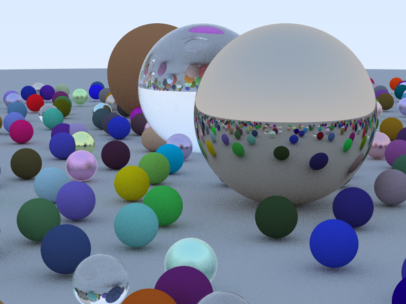

# CUDA Ray Tracer (C++17 + CUDA)

A high-performance CUDA ray tracer that renders a scene with Lambertian, Metal, and Dielectric materials using recursive ray tracing on the GPU. Features optimized camera parameter passing and memory layout for better performance. Builds with CMake and targets modern NVIDIA GPUs using CUDA cores.

## Features
- Pinhole camera with configurable FOV and optimized parameter passing
- Materials: Lambertian (diffuse), Metal (reflective, with fuzz), Dielectric (refractive)
- Recursive ray tracing with depth control and safe recursion handling
- Gradient sky background with proper gamma correction
- Optimized CUDA kernel with one-thread-per-pixel and progress logging
- Output: `output.ppm` (PPM format) and `output.png` (converted)

## Build and Run
```bash
# From repo root
bash cuda-raytracer/build.sh
```
This will configure and build with CMake/NVCC and run the renderer, writing `output.ppm` in the repo root. The build script prints progress by row chunks as it renders.

## Result Image
Below is the output produced by the current configuration (PNG for GitHub preview).

<p align="center">
  
  <br/>
  <sub>Original PPM also available as <code>output.ppm</code>.</sub>
</p>

### If PPM preview does not render on your viewer
Convert PPM to PNG (requires ImageMagick):
```bash
convert output.ppm output.png
```
Then you can view it locally or embed it in Markdown:
```markdown

```

## Tuning
Edit `cuda-raytracer/main.cpp`:
- Image size: `image_width`, `image_height` (default 800x600)
- Anti-aliasing: `samples_per_pixel` (default 50)
- Recursion depth: `max_depth` (default 10, increase for more reflections/refractions)
- Camera: Position and look-at point in `main.cpp`
- Scene: `host_spheres` (materials: 0 = Lambertian, 1 = Metal, 2 = Dielectric)

For better quality:
- Increase `samples_per_pixel` for reduced noise (50-500 recommended)
- Increase `max_depth` for more accurate reflections/refractions (10-50)
- Adjust camera position and look-at point in `main.cpp`

## Project Layout
- `cuda-raytracer/` — source code and CMake project
  - `vec3.h`, `ray.h`, `utils.h`, `camera.h`, `color.h`
  - `sphere.h`, `hittable.h`, `hittable_list.h`, `material.h`
  - `kernels.cu` (CUDA kernel + host launch wrapper)
  - `main.cpp` (host setup, kernel launch, PPM output)
  - `CMakeLists.txt`, `build.sh`
- `output.ppm` — rendered image (written at repo root)

## Requirements
- NVIDIA GPU with CUDA support (Ampere/SM 86 recommended)
- CUDA Toolkit (tested with CUDA 13)
- CMake 3.18+
- A C++17 compiler

## Performance Optimizations
- Uses plain-old-data (POD) `CameraParams` for efficient GPU memory access
- Safe recursion handling with depth-based termination
- NaN/Inf protection for numerical stability
- Optimized memory layout for ray tracing data structures

## Notes
- Only CUDA APIs are used (no RTX cores / OptiX)
- Code is annotated with `__host__`/`__device__` for CUDA compatibility
- Brute-force sphere intersection for simplicity (suitable for learning)
- Easy to extend with BVH, textures, or additional primitives
